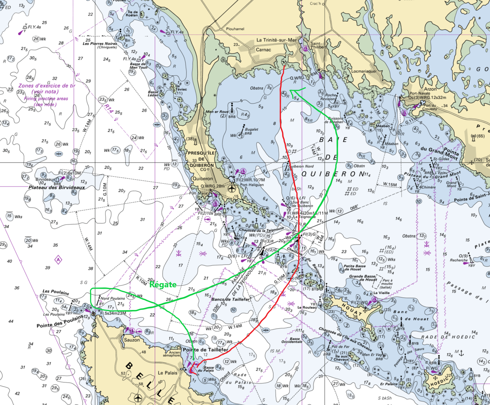

[<- back](.)

# Croisière Dans Les Anglo-Normandes

Dates: 29 Avril - 4 Mai 2025

Equipiers: Houda, Thomas, Sirine, Clément

Monocoque: Pogo 30

## Navigations

AR La Trinité Belle-Île Le Palais du Samedi au Dimanche, petite régate, aller au près puis retour au portant sous spi après avoir enroulé une cardinale.

## Récit

Huit de nos marins, répartis sur deux Pogo 30 ont écumé la baie de Quiberon samedi et dimanche !

Au programme le samedi : départ de la Trinité sur Mer, révision des manœuvres et destination le port du Palais à Belle-Ile dans une mer légèrement agitée au passage de la Teignouse et dans un vent d'ouest
modéré d'une dizaine de nœuds.

Pour clore cette belle navigation, rien de mieux qu'un bord sous spi le long de la pointe des Poulains.

Le dimanche, nos deux bâtiments ont régaté sur un parcours d'une quinzaine de milles entre Belle-Ile et la presqu'île de Quiberon. Stratégie, gestion des courants et réglages fin étaient au rendez-vous. Sous un ciel azur et dans un vent frôlant les vingt nœuds, les bords de spi furent particulièrement savoureux, avec un nouveau record de vitesse pour l'équipe voile : 12 nœuds.

Rien de mieux que ces mots de Victor Hugo dans les travailleurs de la mer pour résumer l'état d'esprit de nos gabiers le dimanche soir :
"On contemplait la mer, on écoutait le vent, on se sentait gagné par l'assoupissement de l'extase. Quand les yeux sont remplis d'un excès de beauté et de lumière, c'est une volupté de les fermer."

## Galerie

  
  
  

<a class="nav-lb-prev" href="#ph3">‹</a><a class="nav-lb-next" href="#ph2">›</a><a class="nav-lb-x" href="#galerie">×</a>

<a class="nav-lb-prev" href="#ph1">‹</a><a class="nav-lb-next" href="#ph3">›</a><a class="nav-lb-x" href="#galerie">×</a>

<a class="nav-lb-prev" href="#ph2">‹</a><a class="nav-lb-next" href="#ph1">›</a><a class="nav-lb-x" href="#galerie">×</a>
