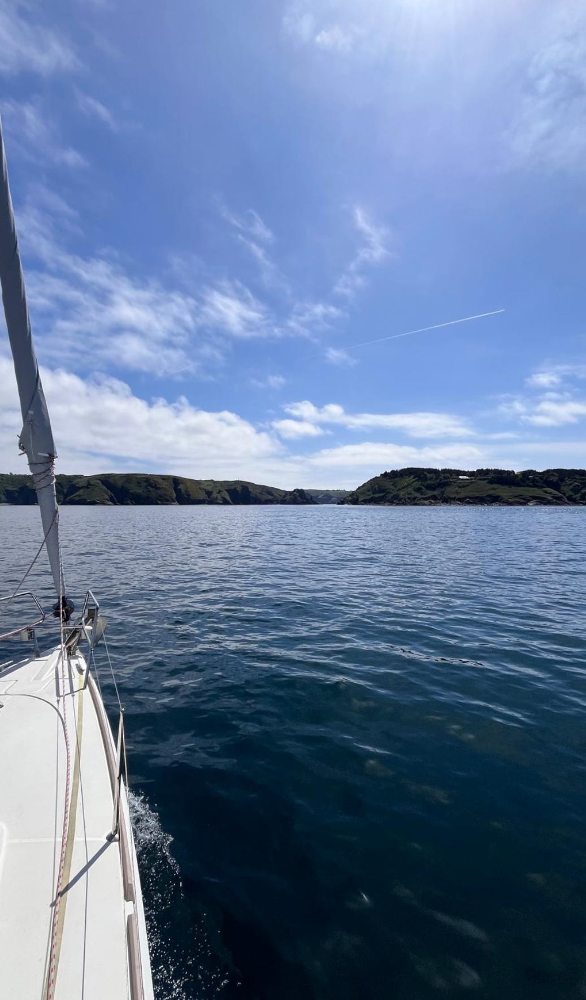

[<- back](.)

# Croisière Dans Les Anglo-Normandes

Dates: 29 Avril - 4 Mai 2024

Equipiers: Louis-Marie, Adrien (skippeur), Blandine, Blandine, Marie-Alix, Clément, Capucine, Balthazar

Monocoque: Corail (Sun Odyssey 379)

## Navigations

### Mardi 29 Avril 2025

Arrivée au Bateau à Saint-Quay-Portrieux et avitaillement.

### Mercredi 30 Avril 2025

Check-in avec le loueur et départ pour Bréhat. Mouillage à Bréhat, visite de l'île.

### Jeudi 1er Mai 2025

Traversée vers Guernesey (environ 10h de nav). Arrivée à St Peter et visite rapide.

### Vendredi 2 Mai 2025

Nav vers Sark. Mouillage à Sark. Visite de l'île. Retour vers Guernesey au port de Beaucette Marina (entrée très étroite dans une ancienne carrière). 
Tentative de trouver un alignement d'une bouée jaune par le vieux Moulin.

### Samedi 3 Mai 2025

Traversée vers Saint Cast le Guildo. Pas mal de Spi.

### Dimanche 4 Mai 2025

Retour à Saint Quay en passant Fréhel avec le bon courant. Force 6 avec > 20 noeuds de vent mais soleil. Chute en cours de nav de la descente.

