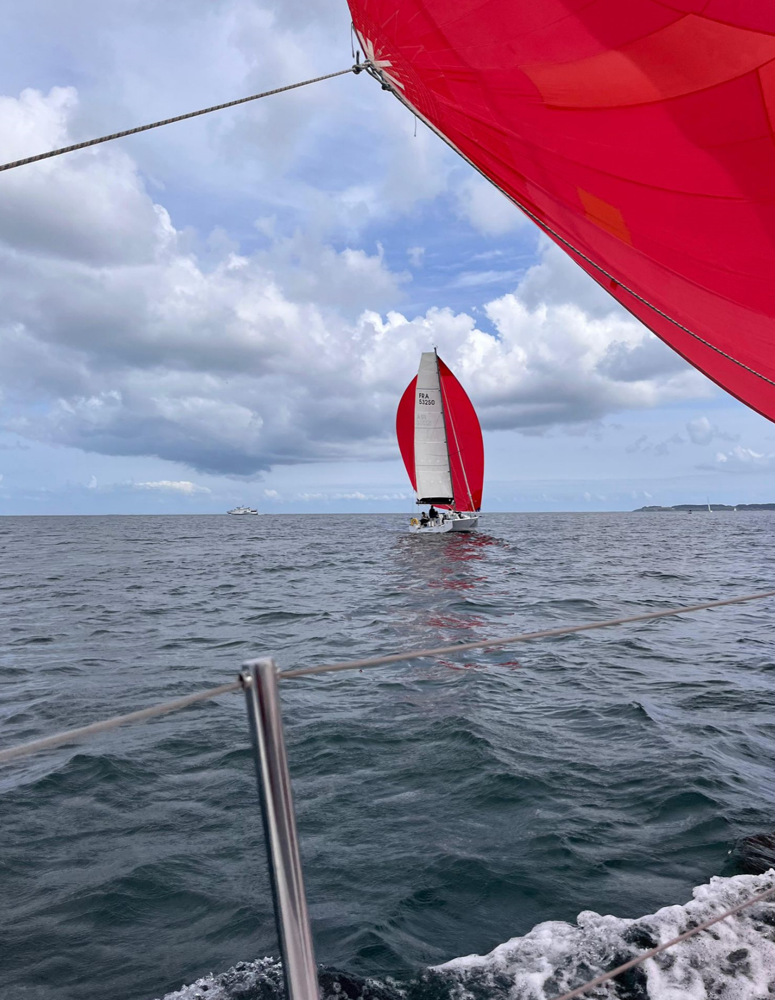
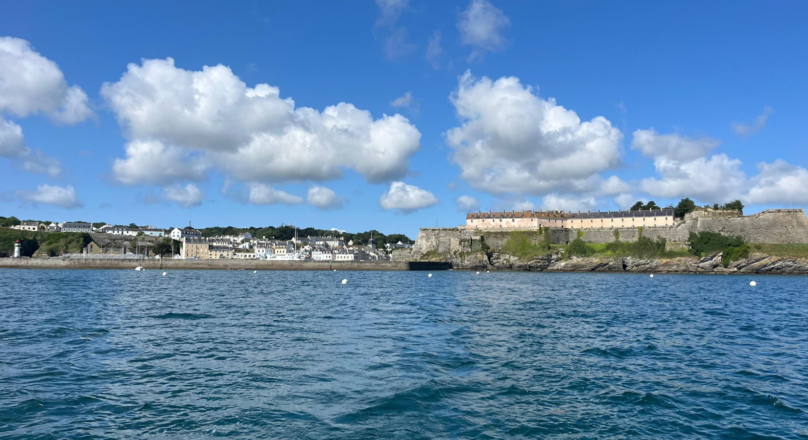
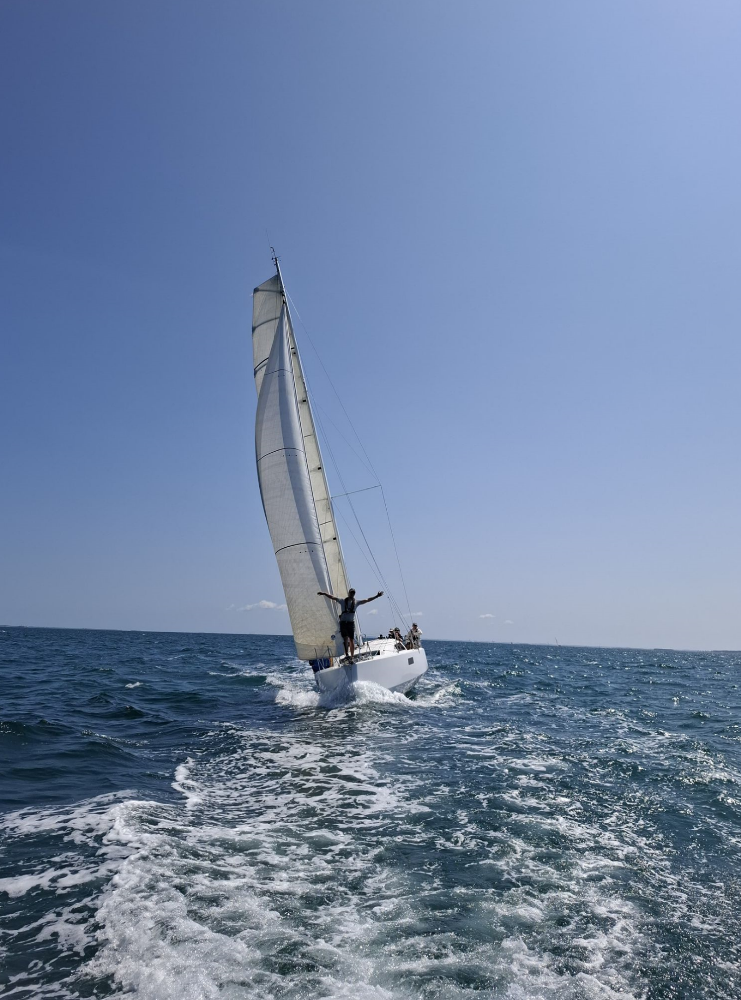
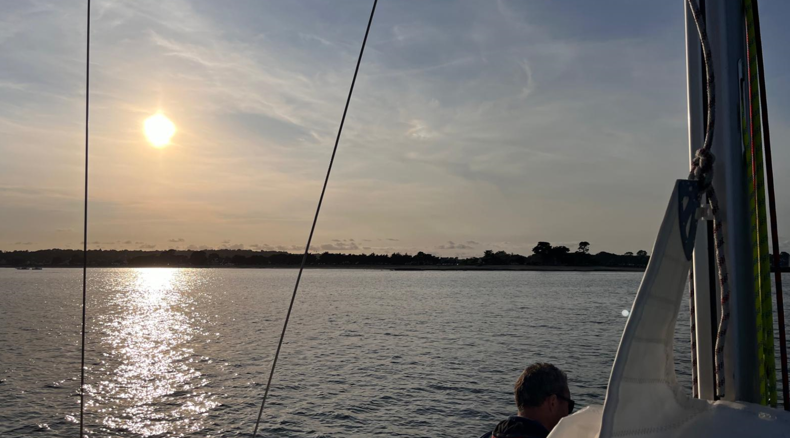

[<- back](.)

# Croisière en Mer d'Iroise

Dates : 14 - 17 Mai 2026

Équipiers : Adrien, Louis-Marie, Camille, Priscille, Julie, Sibylle, Blandine, Clément

Monocoque : First

## Navigations

### Jour 1/4 : Brest → Landévennec → Camaret-sur-Mer

Départ du port de Brest en direction de la rade, avec une première escale au calme de l'abbaye de Landévennec nichée au fond de l'Aulne maritime. Après une navigation dans un paysage mêlant falaises boisées et courants de marée, cap vers la pointe de Roscanvel puis Camaret-sur-Mer, son port mythique et sa célèbre tour Vauban.

### Jour 2/4 : Camaret-sur-Mer → Morgat → Douarnenez

### Jour 3/4 : Douarnenez → Aber Ildut

### Jour 4/4 : Aber Ildut → Anse de Bertheaume → Brest

## Galerie

  
  

<a class="nav-lb-prev" href="#ph2">‹</a><a class="nav-lb-next" href="#ph2">›</a><a class="nav-lb-x" href="#galerie">×</a>

<a class="nav-lb-prev" href="#ph1">‹</a><a class="nav-lb-next" href="#ph1">›</a><a class="nav-lb-x" href="#galerie">×</a>

