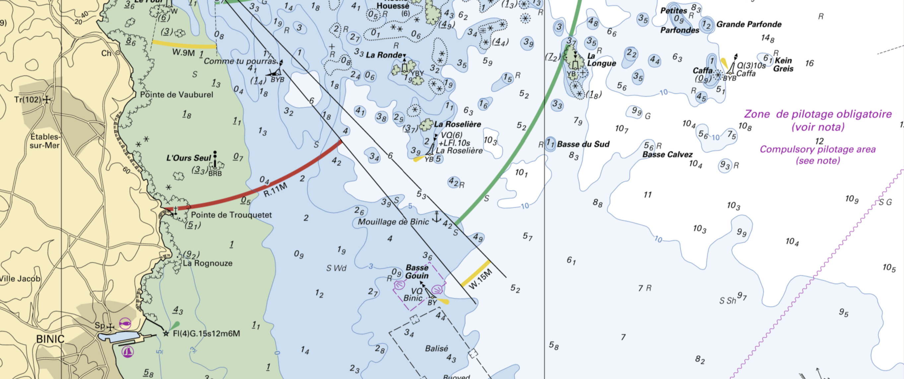
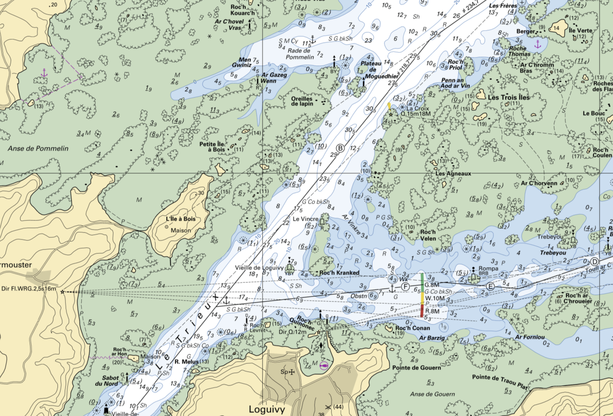

[<- back](.)

# Stage Glénans Niveau 3 Paimpol - Équipier Polyvalent

Dates: 23 Août - 28 août 2025

Equipiers: LM, Julien, Japs (mono), Nathan, Étienne, Clément

Monocoque: Django 9.80

## Navigations

### Samedi 23 août (Paimpol vers Lézardrieux)

Départ de Paimpol pour Lézardrieux, vent Nord Est 9 ou 8 knts.

Alignement arrière du Denou au 193, Clocher de Plouezec par pyramide blanchie du Denou après l'île de Saint Rion.

### Dimanche 24 août (Lézardrieux vers Tréguier)

Plan de nav:

Le Trieux, phare de bodic & phare de la croix à 224.8
Chenal de la Moisie, chapelle st michel et amer du rosedo 159.4

Passe de la gaine : amer de plougrescant et tourelle men noblance 241.8

A cause de la marée : contourner les Héaux de Bréhat à cause de la marée, passe du nord est.

Puis au petit pen ar Guezec prendre 215.5 partie nord de roch skeivec par le phare de la corne

Tourelles de Pen ar Guezec:

En pratique : on est allé à l’Ouest pour des exercices et on a dû remonter au vent d’Est pendant un moment en tirant des bords

Exercice de relèvement avec Nathan:
165 chateau d'eau
207 Rocher
224 Verte (pas sûr de laquelle sur la carte, trait gris ?)

Arrivée à Treguier vers 20h45.

### Lundi 25 août (Tréguier vers port blanc)

Départ de Tréguier vers Port Blanc au mouillage,
Exercices HLM "ralingue":

Gréage et hissage bref du Spi.

Baignade.

### Mardi 26 août (Port Blanc vers Binic)

Départ de Port Blanc vers 4h30 de nuit pour Binic pour un enavigation de nuit.

Plan de nav:

Rester dans le secteur blanc du phare

Carte

    

Alignement à 224,8 des deux phares

Carte

Phare pour la grande passe

Carte

Prendre à l’est à 90 degré, eviter la jument (cardinal Nord qui flashe en continue)

Phare des Heaut Breat confirme notre position.

Carte

Mouillage pour midi dans **l'Anse de Bréhec**. Départ de feu sur la côt après l'Anse.

Passage entre les roches de St Quay et St Quay (je gardais aligné la pointe de la digue de St Quay avec le Château d'eau pour éviter les roches). Petite maison blanche distinctive sur les roches.

Carte

### Mercredi 27 août (Binic vers Lézardrieux, temps moyen, de la pluie)

Cardinal binic à tribord
Puis la roselière
Puis la longue

Carte

Dépasser alignement Les hors avec Caffa sur babord : quand Les hors passe à droite de Caffa, virer, viser cap 350

Cap 300
La mauve (ile) à babord

Un ou deux bords jusqu'à voir Bréhat et le Ferlas.

Dans la pluie, par vent d'Est ou Sud-Est nous avons passé le Ferlat après pas mal de bord de près, dont certains à contre courant pour passer par la "porte" entre les deux cardinales sud (Lel Ar serive) et Nord (Cadenenou).

Carte

Puis remontée dans le Trieux après quelques exercices dans la **Rade de Pommelin**.

Carte

### Jeudi 28 août (Lézardrieux)

Manoeuvres de port :  accostage au ponton et 360

Description du 360: 

- coup de fouet vers l'avant avec la barre braquée à tribord

- puis léger coup de fouet vers l'arrière en repassant bien par point mort (toujours pour éviter d'abîmer le moteur)

- coup de fouet vers l'avant en inversant la barre pour finir le tour

## Notes perso

Bosse empointure : tend la GV sur la bordure

Regle de cras et -180 pour relèvements quand on les voit de l'arrière.

Gimgembre confit pour le mal de mer !

Pilote côtier très utile pour la nav, les passes ou les ports.

Feux à secteurs dans la nuit pour se repérer.

## Chronologies

### Prise de ris :

Prérequis
1/ au près
2/ eau à courir
3/ délover les bouts

Action

NB: **Guindant / bordure / chute** pour hisser actionnés par drisse, bosse empointure, ecoute. Pour la prise de ris on raisonne dans l'autre sens: **Chute / bordure / Guindant** ce qui nous indique quoi actionner et dans quel ordre.

Ici chute puis bordure puis guindant:

Choquer la balancine et le pataras

Choquer halebas + GV (chute)

Choquer les ris (ouvrir taquet) + bosse d empointure (bordure)

Laisser filer la drisse (reprendre légèrement sur le winch pr ouvrir le taquet)

Numéro 1 accroche l’anneau

Puis inverse pour finir la manoeuvre : g b c 

Reprendre la balancine, le pataras

### Gréage du spi:

TODO

### Hissage spi:

Pre requis: eau à courir, avoir gréé, etre au grand largue, winchs prets

Actions

Brasser (contre ecoute ?)

Etarquer balancine tangon + border le halebas

Hisser drisse spi

« En tete »

Reprendre l’ecoute

Affaler la VA

### Affalage spi:

Remets VA

Choquer ecoutes

Numero 1 prend la bordure et devente le spi

Percute la drisse et numero range dans le sac

Vhoquer balancine et hale bas du tangon et le decrocher

## Recommendation de stages dans l'ordre (LM)

Conduite manoeuvre

Spe manoeuvre pogo Vannes / Paimpol

3 intensif sur l’autre base