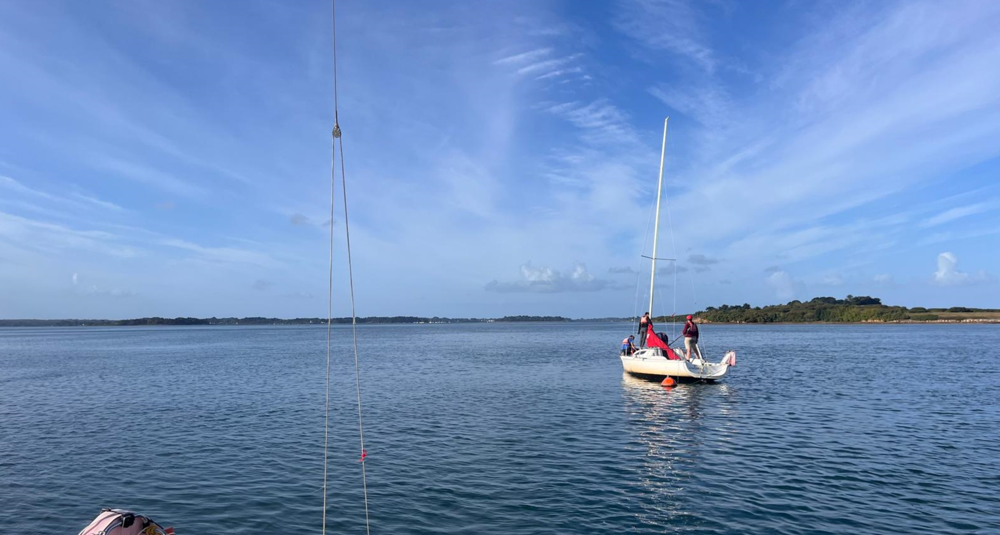

[<- back](.)

# Stage Glénans Niveau 3 Ile d'Arz - Conduite Manoeuvre

Dates: 6 septembre - 9 septembre 2025

Equipiers: Max, Ariane, Barbara (mono), Clément, Luc, Isabelle, Giani (Mono)

Monocoque: 2 surprises

## Navigations

Exercises, prise de coffre, gréage de spi etc

